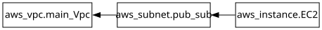

# Terraform Assignment One : AWS Infrastructure Deployment
---
## Objectives
1. Create an IAM user with programmatic access and sufficient permissions.
2. Provision a new VPC and a public subnet.
3. Launch an EC2 instance with specific configurations.
4. Ensure proper network placement and public accessibility.
5. Destroy all provisioned infrastructure using Terraform.
6. 
---
