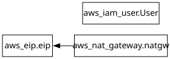

# Terraform Assignment Two : AWS Infrastructure Deployment
---
## Objectives
1. Create a new NAT gateway and a new Elastic IP address, and assign it to the new created NAT
gateway.
2. Display the Elastic IP (EIP), the user arn & the NAT gateway ID on your terminal screen.
3. Finally destroy of all your terraform deployed infrastructure.
4. 
---
